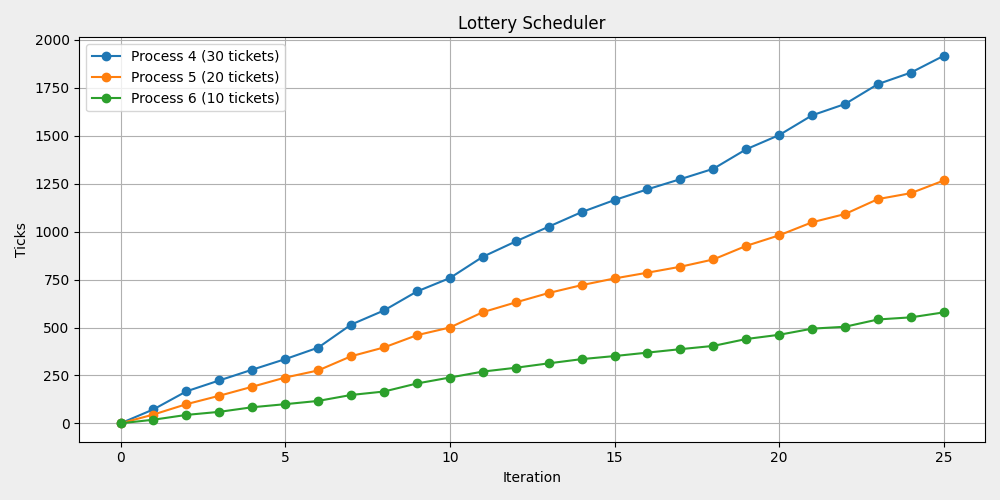

# An xv6 Lottery Scheduler

In this project, you'll be putting a new scheduler into xv6. It is called a
**lottery scheduler**, and the full version is described in [this
chapter](a,href=http://www.cs.wisc.edu/~remzi/OSFEP/cpu-sched-lottery.pdf) of
the online book; you'll be building a simpler one.  The basic idea is simple:
assign each running process a slice of the processor based in proportion to
the number of tickets it has; the more tickets a process has, the more it
runs. Each time slice, a randomized lottery determines the winner of the
lottery; that winning process is the one that runs for that time slice.

The objectives for this project:
* To gain further knowledge of a real kernel, xv6.
* To familiarize yourself with a scheduler.
* To change that scheduler to a new algorithm.
* To make a graph to show your project behaves appropriately.


## Details

You'll need two new system calls to implement this scheduler. The first is
`int settickets(int number)`, which sets the number of tickets of the calling
process. By default, each process should get one ticket; calling this routine
makes it such that a process can raise the number of tickets it receives, and
thus receive a higher proportion of CPU cycles. This routine should return 0
if successful, and -1 otherwise (if, for example, the caller passes in a
number less than one).

The second is `int getpinfo(struct pstat *)`. This routine returns some
information about all running processes, including how many times each has
been chosen to run and the process ID of each. You can use this system call to
build a variant of the command line program `ps`, which can then be called to
see what is going on. The structure `pstat` is defined below; note, you cannot
change this structure, and must use it exactly as is. This routine should
return 0 if successful, and -1 otherwise (if, for example, a bad or NULL
pointer is passed into the kernel).

Most of the code for the scheduler is quite localized and can be found in
`proc.c`; the associated header file, `proc.h` is also quite useful to
examine. To change the scheduler, not much needs to be done; study its control
flow and then try some small changes. 

You'll need to assign tickets to a process when it is created. Specfically,
you'll need to make sure a child process *inherits* the same number of tickets
as its parents. Thus, if the parent has 10 tickets, and calls **fork()** to
create a child process, the child should also get 10 tickets.

You'll also need to figure out how to generate random numbers in the kernel;
some searching should lead you to a simple pseudo-random number generator,
which you can then include in the kernel and use as appropriate.

Finally, you'll need to understand how to fill in the structure `pstat` in the
kernel and pass the results to user space. The structure should look like what
you see here, in a file you'll have to include called `pstat.h`:

```c
#ifndef _PSTAT_H_
#define _PSTAT_H_

#include "param.h"

struct pstat {
  int inuse[NPROC];   // whether this slot of the process table is in use (1 or 0)
  int tickets[NPROC]; // the number of tickets this process has
  int pid[NPROC];     // the PID of each process 
  int ticks[NPROC];   // the number of ticks each process has accumulated 
};

#endif // _PSTAT_H_
```

Good examples of how to pass arguments into the kernel are found in existing
system calls. In particular, follow the path of `read()`, which will lead you
to `sys_read()`, which will show you how to use `argptr()` (and related calls)
to obtain a pointer that has been passed into the kernel. Note how careful the
kernel is with pointers passed from user space -- they are a security
threat(!), and thus must be checked very carefully before usage.


## Graph

Beyond the usual code, you'll have to make a graph for this assignment. The
graph should show the number of time slices a set of three processes receives
over time, where the processes have a 3:2:1 ratio of tickets (e.g., process A
might have 30 tickets, process B 20, and process C 10). The graph is likely to
be pretty boring, but should clearly show that your lottery scheduler works as
desired.


## Result

```sh
prompt> make qemu-nox | tee output.txt
```

```sh
init: starting sh
$ schedtest
```

```
Iteration 1
PID 4 | Tickets 30 | Ticks 73
PID 5 | Tickets 20 | Ticks 46
PID 6 | Tickets 10 | Ticks 19

Iteration 2
PID 4 | Tickets 30 | Ticks 167
PID 5 | Tickets 20 | Ticks 100
PID 6 | Tickets 10 | Ticks 44

⋮

Iteration 25
PID 4 | Tickets 30 | Ticks 1918
PID 5 | Tickets 20 | Ticks 1267
PID 6 | Tickets 10 | Ticks 579

scheduler test finished
```

```sh
prompt> python graph.py output.txt
```




